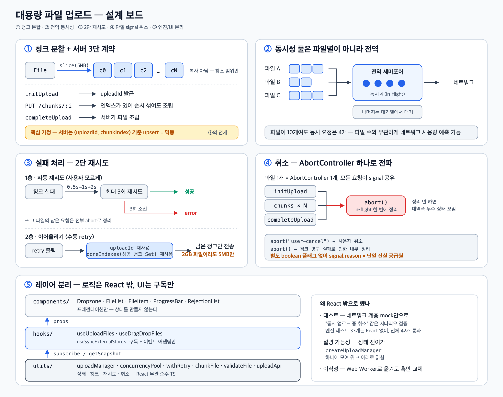

# 대용량 파일 업로드 컴포넌트 설계

## 질문

여러 개의 대용량 파일을 업로드하는 UI는 어떻게 설계하며, 실무에서는 어떤 점을 고려해야 하나요?

## 답변 초안

대용량 파일 업로드의 핵심은 크게 두 가지입니다.

1. **파일을 청크로 나눠 실패의 단위를 "파일 전체"에서 "조각 하나"로 줄이는 것**
2. **업로드 로직(상태·네트워크)을 React 밖의 엔진으로 분리하고, React는 구독만 하는 것**

여기에 검증, 진행률, 취소/재시도, 동시성 제어가 따라붙습니다. 간단해 보이지만 "업로드 중
취소", "실패 후 이어서 재시도" 같은 동시성 엣지 케이스가 많아서, 로직을 컴포넌트 밖으로
빼두지 않으면 테스트도 설명도 어려워집니다.

---

## 설계 한 장 요약



이 문서는 위 보드의 ①~⑤를 그대로 따라갑니다. 각 절 제목이 보드의 번호와 1:1로 대응하니,
그림을 먼저 보고 궁금한 칸으로 바로 내려가면 됩니다.

| 보드 | 주제 | 한 줄 요지 |
|---|---|---|
| ① | 청크 분할 + 서버 3단 계약 | 실패의 단위를 파일 → 5MB 조각으로 |
| ② | 전역 동시성 풀 | 파일 수와 무관하게 동시 요청 4개 고정 |
| ③ | 2단 재시도 | 자동 3회 → 영구 실패 시 남은 청크만 이어올리기 |
| ④ | 단일 AbortSignal 취소 | 파일당 컨트롤러 1개, 취소 여부는 reason으로 판별 |
| ⑤ | 엔진/UI 분리 | 로직은 순수 TS, React는 구독만 |

- 원본(벡터): [docs/upload-board.svg](docs/upload-board.svg) · 발표 5분 스크립트: [TALK-5MIN.md](TALK-5MIN.md) · 12분 버전: [PRESENTATION.md](PRESENTATION.md)
- **실행 방법**: `pnpm --filter file-upload-component dev` → `http://localhost:5173`.
  백엔드 대신 MSW가 `/api/uploads*`를 가로채며, 화면의 "청크 실패율" 슬라이더로
  자동 재시도 → 에러 → 수동 재시도 흐름을 라이브로 볼 수 있습니다.

---

## ① 청크 분할 + 서버 3단 계약

2GB 파일을 요청 하나로 올리면 99%에서 끊겨도 전부 다시 올려야 하고, 진행률을 보여줄
방법도 마땅치 않습니다. 그래서 파일을 5MB 조각으로 나눠 보냅니다.

```ts
// File.slice()는 데이터를 복사하지 않고 참조 범위만 기록한다.
// GB 파일도 청크 목록을 미리 만들어 두는 데 메모리 부담이 없다.
for (let offset = 0; offset < file.size; offset += chunkSize) {
  chunks.push(file.slice(offset, offset + chunkSize));
}
```

서버와 API를 세 번, 정해진 순서로 주고받습니다.

```text
initUpload            → uploadId 발급
PUT /chunks/:index    → 청크 업로드 (인덱스가 있어 도착 순서가 섞여도 조립 가능)
completeUpload        → 서버가 파일 조립
```

**핵심 가정**: 서버는 `(uploadId, chunkIndex)` 기준으로 청크를 **upsert**합니다.
같은 청크를 두 번 보내도 안전(멱등)하다는 뜻이고, 뒤에 나오는 ③의 재시도·이어올리기 전략
전체가 이 가정 위에 서 있습니다. S3 multipart, tus 프로토콜도 같은 원리입니다.

---

## ② 동시성 제어: 풀은 파일별이 아니라 전역

파일마다 동시성을 주면 파일 10개를 올릴 때 동시 연결이 10배로 늘어나 네트워크를
독점합니다. 그래서 **모든 파일의 청크가 하나의 공용 요청 풀을 공유**합니다.

```ts
// 개념만 남긴 코드 — 실제로는 pool.run 안에서 재시도와 진행률 갱신까지 처리한다
await Promise.all(
  remaining.map((index) =>
    pool.run(() => uploadChunk(uploadId, index, chunks[index], signal)),
  ),
);
```

파일을 아무리 많이 추가해도 동시 요청은 4개로 고정되고, 나머지는 풀 대기열에서
기다립니다. 4라는 기본값은 브라우저의 호스트당 동시 연결 한계(~6)와 다른 트래픽 여유를
고려한 값이고, `maxConcurrentChunks` config로 조정할 수 있습니다.

---

## ③ 실패 처리: 2단 재시도

**1층 — 자동 재시도.** 청크 하나가 실패하면 지수 백오프(0.5s → 1s → 2s)로 최대 3회
조용히 다시 보냅니다. 일시적인 네트워크 흔들림은 사용자가 모르게 지나갑니다.

**2층 — 영구 실패 후 이어올리기.** 3회를 다 써도 실패하면 그 파일의 나머지 요청을
전부 중단하고 `error`로 전환합니다. 사용자가 재시도를 누르면 **처음부터 올리지 않고**,
세션에 남은 `uploadId`와 성공한 청크 인덱스(`doneIndexes`)를 재사용해 남은 청크만
이어서 올립니다.

```ts
const remaining = chunks
  .map((_, index) => index)
  .filter((index) => !doneIndexes.has(index)); // 성공한 청크는 건너뛴다
```

2GB 파일이 마지막 청크에서 죽어도 다시 올리는 건 5MB뿐입니다. 이게 가능한 근거가
①의 upsert 가정입니다.

---

## ④ 취소: AbortSignal 하나로 전파

파일 하나의 모든 요청(init, 청크들, complete)이 `AbortController` 하나를 공유합니다.
`cancel()`이 `abort()`를 호출하면 in-flight 요청이 한 번에 끊깁니다.

"사용자가 취소했는가"의 판별은 별도 boolean 플래그가 아니라 **abort reason**으로 합니다.

```ts
controller.abort("user-cancel");        // 사용자 취소
controller.abort();                     // 청크 영구 실패로 인한 내부 정리
// → signal.reason === "user-cancel" 인지로 두 경로를 구분
```

플래그를 따로 두면 abort 경로가 추가될 때마다 동기화를 깜빡할 수 있어서, signal을
단일 진실 공급원으로 삼았습니다.

엣지 케이스 둘:

- **시작 전 취소** — `queued` 상태에선 아직 요청이 없지만, 상태를 `canceled`로 바꿔 두면
  시작 시점에 확인하고 포기합니다.
- **완료와 취소가 겹치면** — `completeUpload`가 이미 성공했다면 서버엔 파일이 완성돼
  있으므로 `success`로 확정합니다. 서버와 클라이언트 상태가 어긋나는 것을 막기 위한
  선택입니다.

---

## ⑤ 전체 구조: 엔진과 UI의 분리

```text
components/  Dropzone, FileList, ProgressBar …     ← 프레젠테이션만
     ↑ props
hooks/       useUploadFiles, useDragDropFiles       ← 이벤트 어댑팅 + 구독만
     ↑ subscribe / getSnapshot
utils/       uploadManager, uploadApi, validateFile, chunkFile, withRetry, concurrencyPool …
             ← 상태 + 청크 + 재시도 + 취소 (React 무관 순수 TS)
```

①~④의 로직이 전부 이 아래층(`utils/`)에 있습니다. React 밖에 둔 이유는 세 가지입니다.

- **테스트** — "동시 업로드 중 취소" 같은 까다로운 로직을 네트워크 계층(`uploadApi`)
  mock만으로 검증할 수 있습니다 (React 없이 도는 엔진 테스트 33개, 전체 42개).
- **설명 가능성** — 상태 전이가 `createUploadManager` 함수 하나에 모여 있어 위에서
  아래로 읽힙니다.
- **이식성** — 다른 프레임워크나 Web Worker로 옮겨도 훅만 새로 짜면 됩니다.

훅은 `useSyncExternalStore`로 엔진을 구독하고, input 이벤트 처리·파일 정렬·거부 콜백
전달 같은 어댑팅만 합니다.

```tsx
const { uploadFiles, isLoading, handleFilesAdd, handleFileCancel, handleFileRetry } =
  useUploadFiles({ onFilesRejected: setRejections });
```

---

## 보드에 없는 보충: 상태 모델과 진행률

보드는 네트워크 흐름 위주라서 상태 모델은 담지 않았습니다. 꼬리질문에 대비해 남겨둡니다.

파일 하나의 상태는 5개뿐입니다.

```text
queued → uploading → success
              ├────→ error ──(수동 retry)──→ queued로 복귀
              └────→ canceled
```

흐름은: 파일 선택/드롭 → 검증(빈 파일·2GB 초과·확장자·중복 이름·개수 제한) →
통과한 파일만 `queued` 등록 → 청크 업로드 → 완료 시 `success`.

검증에서 거부된 파일은 상태로 만들지 않고 `{file, error}` 목록으로 콜백에 넘겨,
토스트든 인라인 목록이든 호출부가 노출 방식을 정하게 했습니다. 파일 최대 개수 제한
(기본 10개)도 기술적 한계가 아니라 UX 가드레일입니다.

진행률은 기본적으로 청크가 완료될 때마다 갱신합니다. 네트워크 계층은 axios라서
`uploadApi.uploadChunk`에 전달한 `onUploadProgress` 콜백으로 바이트 단위 진행률도
받을 수 있습니다. 다만 현재 UI는 5MB 청크 단위 갱신만으로도 progress bar가 충분히
매끄럽게 움직여서 상태 모델을 단순하게 유지했습니다.

```ts
doneIndexes.add(index); // 성공한 청크 인덱스 Set
progress = Math.round((doneIndexes.size / chunks.length) * 100);
```

---

## 실무 주의점

- 청크 재시도·재개 전략은 서버의 멱등성(같은 요청을 여러 번 보내도 서버의 최종 결과가
  달라지지 않음) 보장이 전제입니다. → 보드 ①
- `fetch`는 업로드 방향의 바이트 단위 진행 이벤트가 없습니다. 이 프로젝트는 axios를
  씁니다. axios의 `onUploadProgress`는 내부적으로 XHR의 progress 이벤트를 감싼 것이라
  바이트 단위 진행률이 가능하고, `signal` 옵션으로 `AbortController` 연동도 됩니다.
  fetch로 가려면 청크를 잘게 쪼개 청크 단위 진행률로 절충해야 합니다.
- 동시성 풀은 파일별이 아니라 전역으로 두어야 파일 수와 무관하게 네트워크 사용량이
  예측 가능합니다. → 보드 ②
- 취소·실패 시 남은 in-flight 요청을 정리하지 않으면 대역폭이 새고 상태가 꼬입니다.
  `AbortController` 공유로 한 번에 정리하는 것이 안전합니다. → 보드 ④
- `useSyncExternalStore`의 `getSnapshot`은 상태가 안 바뀌면 같은 참조를 반환해야
  합니다(무한 리렌더 방지). 스냅샷 캐시가 필요합니다. → 보드 ⑤
- 같은 파일을 연속 선택하면 change 이벤트가 안 뜹니다. 처리 후 `input.value = ""`
  리셋이 필요합니다.
- 파일 개수를 크게 늘리면 병목은 엔진이 아니라 UI입니다. 수백 개 규모면 리스트
  가상화와 진행률 emit 스로틀링을 고려해야 합니다.

---

## 면접 답변

대용량 파일 업로드는 파일 전체를 한 번에 보내지 않고, 5MB 크기의 청크로 나눠 보내도록
설계했습니다. 이렇게 하면 업로드가 중간에 실패하더라도 파일 전체가 아니라 실패한 청크만
다시 보낼 수 있습니다.

업로드 과정은 세 단계입니다. 먼저 서버에 업로드 시작을 요청해 uploadId를 발급받습니다.
그다음 파일을 여러 청크로 나눠 청크별로 업로드하고, 모든 청크가 성공하면 마지막으로
완료 API를 호출해 서버가 하나의 파일로 조립하도록 합니다.

재시도를 안전하게 처리하려면 서버가 동일한 청크를 여러 번 받아도 중복 저장하지 않아야
합니다. 그래서 서버는 uploadId와 chunkIndex를 기준으로 청크를 구분하고, 이미 같은 청크가
있다면 새로 추가하지 않고 덮어쓰거나 성공으로 처리한다고 가정했습니다.

청크 업로드가 실패하면 0.5초, 1초, 2초처럼 대기 시간을 늘려가며 최대 3번 자동으로
재시도합니다. 그래도 실패하면 해당 파일을 에러 상태로 바꿉니다. 이후 사용자가 재시도를
누르면 처음부터 다시 올리는 것이 아니라, 성공한 청크 인덱스를 Set으로 보관해 아직
업로드되지 않은 청크만 이어서 전송합니다.

여러 파일을 동시에 업로드할 때는 모든 파일이 하나의 전역 동시성 풀을 공유하도록 했습니다.
최대 동시 요청 수를 4개로 제한했기 때문에 파일 개수가 늘어나더라도 한꺼번에 실행되는
네트워크 요청 수는 일정하게 유지됩니다.

파일 취소는 파일마다 하나의 AbortController를 생성해 처리합니다. 해당 파일의 업로드 시작
요청, 청크 요청, 완료 요청이 같은 AbortSignal을 사용하도록 하고, 사용자가 취소하거나
복구할 수 없는 오류가 발생하면 abort() 한 번으로 진행 중인 요청을 모두 중단합니다.
사용자 취소인지 내부 오류로 인한 중단인지는 취소 사유를 통해 구분합니다.

마지막으로 업로드 상태와 네트워크 로직은 React 컴포넌트 밖의 순수 TypeScript 모듈로
분리했습니다. React에서는 useSyncExternalStore로 업로드 상태를 구독하고 화면만 갱신합니다.
덕분에 React 렌더링과 관계없이 취소, 재시도, 동시성 같은 업로드 로직을 독립적으로
테스트할 수 있습니다.
